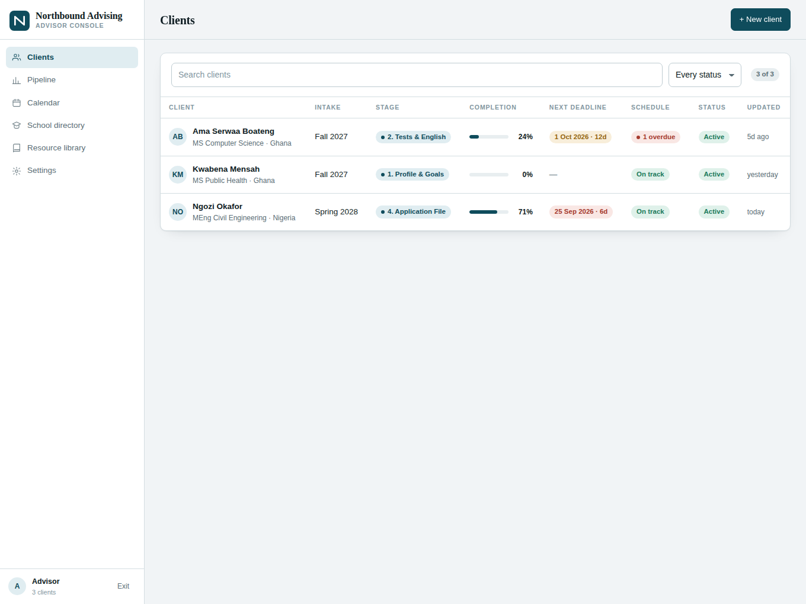
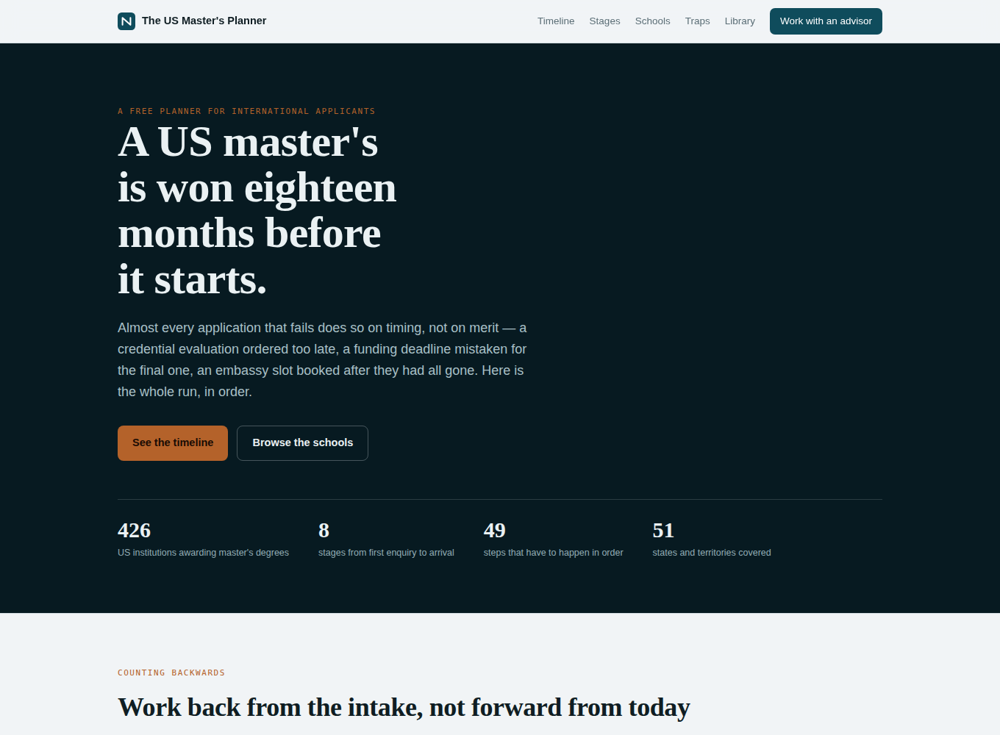
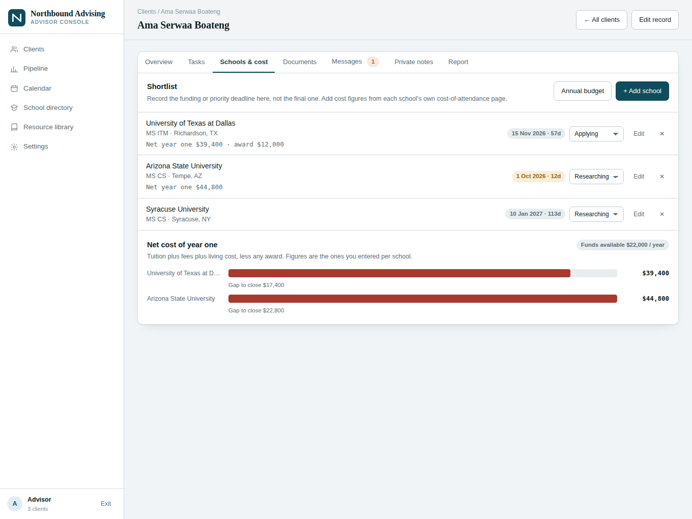
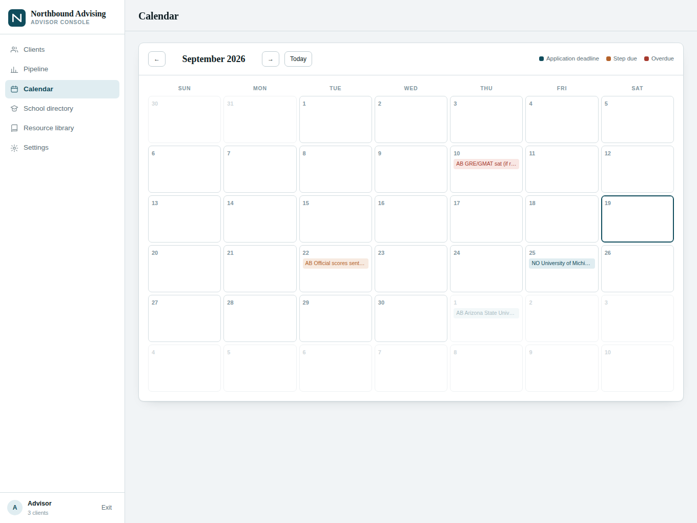

# Northbound Advising

A client-progress platform for advisors who take students through a **US master's application**, end to end — from the first intake call to the airport.

One advisor console over every client, and a portal each client signs into to see their own file and nothing else.

- **49 milestones** across 8 stages, with target dates and overdue flags
- **426 US institutions** that award master's degrees, all 50 states and DC
- **9-section resource library** — timeline, tests, credential evaluation, the application file, funding, I-20 financials, the F-1 visa, pre-departure, post-arrival compliance
- **Cost calculator** — net year-one cost per school against the family's annual budget
- **Fees and outcomes** — what each client owes, what came in, where past clients landed
- **Score and referee tracking** — test scores checked against each programme's stated minimums, letters tracked per referee per school
- **Messaging, document tracking, file attachments, printable status reports**

It builds **two** pages from one set of sources:

| Built file | What it is | Who can open it |
|---|---|---|
| `dist/index.html` | The advisor platform — console plus client portals | You, and clients you share it with |
| `dist/public.html` | **The US Master's Planner** — a public marketing site: the 18-month timeline, all 426 schools, the five traps, the full library | Anyone with the link |

The public site declares no runtime capabilities at all, which is what lets it be shared with the world. It is the front door; the platform is the back office.

Vanilla JavaScript. No framework, no build dependencies, no `node_modules`. The whole thing is one HTML file when built.



<p align="center"></p>

<p align="center">
  
  
</p>

---

## Quick start

```bash
git clone https://github.com/<you>/northbound-advising.git
cd northbound-advising
npm run dev            # builds, then serves http://localhost:5173
```

The dev server runs the app against `dev/harness.js`, a fake of the Claude artifact runtime that gives it an in-memory database, an identity and three sample clients. Nothing persists — reload and you are back to the seed.

```bash
npm run build          # writes dist/index.html and dist/public.html
npm run check          # syntax check every source file
node dev/screenshot.mjs --shots   # headless render: JS errors + overflow (needs playwright)
```

**Before publishing the public site, change one line.** `public/app.js` opens with:

```js
/* --- EDIT ME: the address the "Get in touch" buttons open. --- */
var CONTACT = "hello@example.com";
```

---

## How it runs in production

The built page is published as a **Claude artifact**, which supplies the runtime the app talks to:

| Capability | Used for |
|---|---|
| `db` | The shared document store — clients, templates, codes, notes, messages |
| `user` | Who is viewing, and whether they may edit |
| `assets` | File uploads attached to a client record |

The page asks for each of these with `await window.claude.use(name)` and degrades gracefully when one is missing — `dev/harness.js` exists precisely because the app must work without them.

Publishing (from a Claude session that owns the artifact):

```
Artifact → publish
  file_path:    dist/index.html
  capabilities: { db: { rules: [...] }, user: {}, assets: {} }
```

The access rules the live copy uses are in [`docs/DATA-MODEL.md`](docs/DATA-MODEL.md).

> **Hosting it anywhere else** — GitHub Pages, Netlify, Vercel — serves the page fine, but there is no `window.claude`, so every `use()` resolves `null`, the app shows *"Shared storage is unavailable"* and nothing saves. See [Where this goes next](#where-this-goes-next).

---

## Layout

```
src/
  shell.html            design tokens, all CSS, the static markup skeleton
  data/schools.js       426 institutions → window.NB_SCHOOLS
  data/content.js       stages, 49 task templates, 17 documents, resource library
  app/core.js           state, derived values, storage, auth, boot → window.NB
  app/views.js          every screen, every event handler
public/
  shell.html            the public site's own markup and CSS
  app.js                its script — school explorer, library, timeline ruler
build.mjs               builds dist/index.html, dist/public.html and dev/preview.html
dev/harness.js          fake window.claude for local work
dev/serve.mjs           dependency-free static server
dev/screenshot.mjs      headless render check
seed/                   the documents that populate a fresh database
docs/DATA-MODEL.md      collections, document shapes, access rules
dist/                   built output (committed, ready to publish)
```

Load order is fixed and matters: data globals → `core.js` (defines `window.NB`) → `views.js` (consumes it, then calls `NB.boot()`). Both pages read the same `src/data/` files, so a school added once shows up in both.

---

## Two ways in

**Advisor.** The account that owns the artifact lands straight in the console. Anyone else uses the advisor passcode from Settings.

**Client.** An access code like `NB-4821`. The code is checked against a single lookup document, and the session then subscribes to **one client record** — the client list is never fetched, so no other client's data reaches that browser.

Private advisor notes and everything about money live in separate `notes/` and `billing/` collections restricted to editors. A client cannot read either through the page or underneath it; the store itself refuses.

### The limit, stated plainly

Progress records still live in one shared store. Someone technical who has been given the link could, with effort, reach another client's progress data outside the page. The codes and the notes split cover ordinary client confidentiality. **A hard guarantee needs a real server** — see below.

---

## Seeding a fresh database

`seed/` holds the documents a new install needs. Paths map to collections directly:

| File | Document path |
|---|---|
| `seed/config.app.json` | `config/app` |
| `seed/templates.default.json` | `templates/default` |
| `seed/clients/<id>.json` | `clients/<id>` |
| `seed/notes/<id>.json` | `notes/<id>` |
| `seed/messages/<cid>__<mid>.json` | `clients/<cid>/messages/<mid>` |
| `seed/codes.json` | one `codes/<CODE>` document per key |

The sample clients are fictional. Delete them once real records are in — the advisor console has a Delete on each, which also drops the access code and the notes.

---

## Where this goes next

The artifact runtime is a good place to *prove* this product. It is not where it ends up, for one reason: an artifact that stores shared data is scoped to the owner's Claude organisation, so a client on a personal email may not be able to open it at all — and an outside visitor who can gets read-only access, which makes the portal useless to them.

The public planner at `dist/public.html` sidesteps this today — it stores nothing, so it shares with anyone. Use it as the front door while the platform stays the back office.

The next version of the platform is an ordinary web app:

- **Next.js** front end, porting these screens component by component
- **Supabase** or **Firebase** for auth — real accounts, email and password, password reset
- **Row-level security** on `clients`, keyed to the signed-in user, so isolation is enforced by the database rather than by the page
- Client-side file uploads, and email reminders when a target date is close

Everything in `src/data/` and the whole progress model port across unchanged.

---

## License

MIT — see [LICENSE](LICENSE).

The resource library is general planning information, not legal or immigration advice. Requirements differ by school, by embassy and by year; the library links to the official sources for each one.
