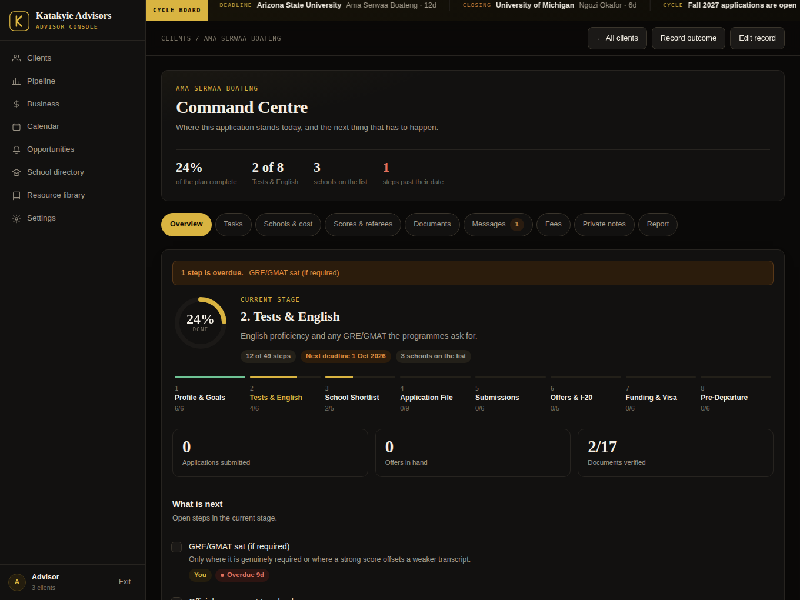
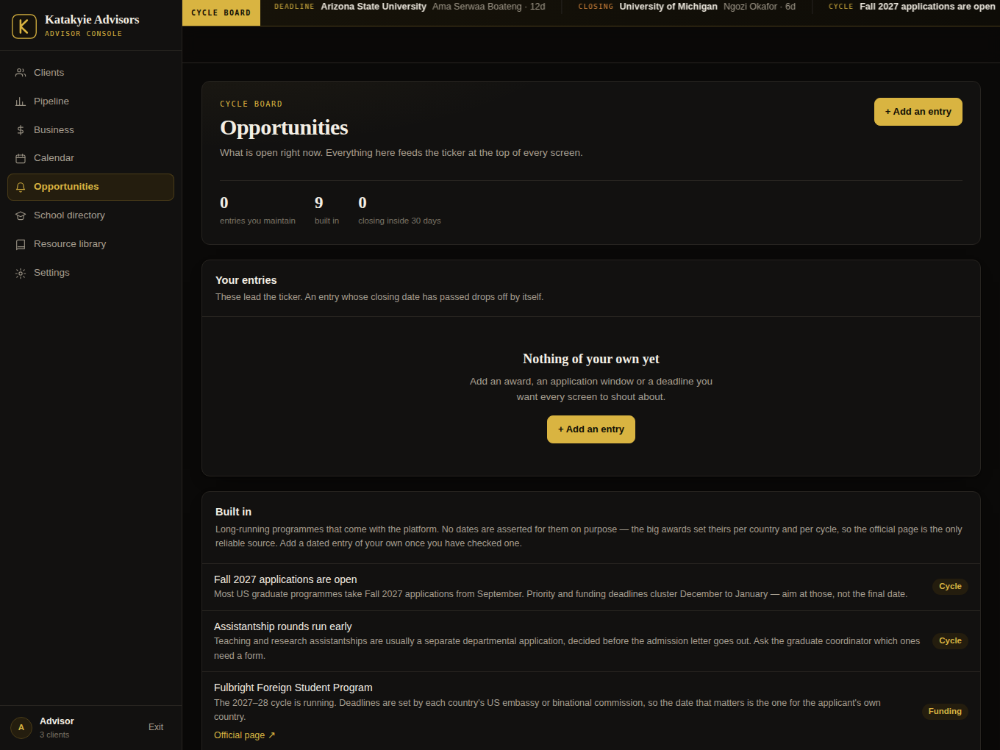

# Katakyie Academic Advisor

A client-progress platform for advisors who take students through a **US master's application**, end to end — from the first intake call to the airport.

One advisor console over every client, and a portal each client signs into to see their own file and nothing else.

- **49 milestones** across 8 stages, with target dates and overdue flags
- **846 US institutions** that award master's degrees, all 50 states and DC, extendable from inside the app
- **9-section resource library** — timeline, tests, credential evaluation, the application file, funding, I-20 financials, the F-1 visa, pre-departure, post-arrival compliance
- **Cost calculator** — net year-one cost per school against the family's annual budget
- **Fees and outcomes** — what each client owes, what came in, where past clients landed
- **Score and referee tracking** — test scores checked against each programme's stated minimums, letters tracked per referee per school
- **A cycle ticker** across the top of every screen — funding programmes, application windows and the deadlines on your own clients' shortlists
- **Messaging, document tracking, file attachments, printable status reports**

It builds **two** pages from one set of sources:

| Built output | What it is | Where it runs |
|---|---|---|
| `dist/index.html` | The advisor platform — console plus client portals | A Claude artifact. **Needs the artifact runtime for its database**, so it is not a static page |
| `dist/public.html` | The planner, as a Claude artifact | A Claude artifact |
| `site/` | The planner, as a real website — full HTML document, social preview tags, favicon, robots and sitemap | **GitHub Pages, Netlify, Vercel, any static host** |
| `site/demo/` | The dashboard as a **working demo** — real database, backed by the visitor's own browser | The same static host |
| `site/portal/` | The **client portal** — a read-only snapshot of one applicant's file, carried in the link | The same static host |

The planner declares no runtime capabilities at all. That is what lets it be shared with the world, and it is also why it works as a plain static site. It is the front door; the platform is the back office.

Vanilla JavaScript. No framework, no build dependencies, no `node_modules`. The whole thing is one HTML file when built.


<p align="center">
  
  
</p>


---

## Quick start

```bash
git clone https://github.com/<you>/katakyie-advisors.git
cd katakyie-advisors
npm run dev            # builds, then serves http://localhost:5173
```

The dev server runs the app against `dev/harness.js`, a fake of the Claude artifact runtime that gives it an in-memory database, an identity and three sample clients. Nothing persists — reload and you are back to the seed.

```bash
npm run build          # writes dist/ and site/
npm run check          # syntax check every source file
npm run site           # build, then serve site/ at http://localhost:5174
node dev/screenshot.mjs --shots   # headless render: JS errors + overflow (needs playwright)
```

---

## How it runs in production

The built page is published as a **Claude artifact**, which supplies the runtime the app talks to:

| Capability | Used for |
|---|---|
| `db` | The shared document store — clients, templates, codes, notes, messages |
| `user` | Who is viewing, and whether they may edit |
| `assets` | File uploads attached to a client record |

The page asks for each of these with `await window.claude.use(name)` and degrades gracefully when one is missing — `dev/harness.js` exists precisely because the app must work without them.

Publishing (from a Claude session that owns the artifact):

```
Artifact → publish
  file_path:    dist/index.html
  capabilities: { db: { rules: [...] }, user: {}, assets: {} }
```

The access rules the live copy uses are in [`docs/DATA-MODEL.md`](docs/DATA-MODEL.md).

> **Do not host the platform statically.** GitHub Pages will serve `dist/index.html` happily, but there is no `window.claude` there, so every `use()` resolves `null`, the app shows *"Shared storage is unavailable"* and nothing saves. Only `site/` is meant for a static host. See [Where this goes next](#where-this-goes-next).

---

## Publishing the planner on GitHub Pages

The repository ships with a workflow that builds `site/` and deploys it. Two things to do once.

**1. Fill in `site.config.json`.**

```json
{
  "org": "Katakyie Academic Advisor",
  "siteUrl": "https://YOURNAME.github.io/katakyie-advisors",
  "contactEmail": "hello@example.com",
  "portalUrl": ""
}
```

- `siteUrl` — where the site will live, no trailing slash. It drives the canonical link and the social preview; get it wrong and a link shared on WhatsApp shows no card.
- `contactEmail` — the address every "Get in touch" button opens. **Change this before you publish**, or the site's only call to action goes nowhere.
- `portalUrl` — optional. Put the platform's URL here and a *Client sign in* link appears in the top bar. Leave it empty and the link stays hidden. Note that only people you have shared the platform with can open it.
- `customDomain` — add this key with a domain and the build writes a `CNAME` file for you.

The site publishes with a **demo of the dashboard** at `/demo/`, linked from the top bar. It is the same platform code in front of `demo/runtime.js`, a localStorage-backed stand-in for the artifact runtime — so everything genuinely works and everything a visitor changes persists, in their browser alone. Three fictional clients are seeded, a banner says plainly what it is, and there is a reset button. It is for showing people what you run; it is not a shared system and it is marked `noindex`.

**2. Turn Pages on.** In the repository: **Settings → Pages → Build and deployment → Source: GitHub Actions**. Push to `main` and the workflow runs — it checks every source file parses, builds, and publishes `site/`. A minute or so later the site is live at `siteUrl`.

The build is checked into the workflow, not the repository: `site/` is in `.gitignore`, so nothing built is ever committed. If you would rather not use Actions, delete `.github/workflows/pages.yml`, remove `site/` from `.gitignore`, commit the folder, and point Pages at a branch instead.

Netlify and Vercel need no workflow at all — build command `node build.mjs`, publish directory `site`.

---

## Layout

```
src/
  shell.html            design tokens, all CSS, the static markup skeleton
  data/schools.js       846 institutions → window.NB_SCHOOLS
  data/content.js       stages, 49 task templates, 17 documents, resource library, cycle board
  app/core.js           state, derived values, storage, auth, boot → window.NB
  app/views.js          every screen, every event handler
public/
  shell.html            the public site's own markup and CSS
  app.js                its script — school explorer, library, timeline ruler
site.config.json        org name, site URL, contact address, optional portal link
build.mjs               builds dist/, site/ and dev/preview.html
.github/workflows/      the GitHub Pages deployment
demo/runtime.js         localStorage runtime — makes the demo dashboard actually work
dev/harness.js          fake window.claude for local work
dev/serve.mjs           dependency-free static server
dev/screenshot.mjs      headless render check
seed/                   the documents that populate a fresh database
docs/DATA-MODEL.md      collections, document shapes, access rules
dist/                   built artifacts (committed, ready to publish)
site/                   the static website (built, not committed)
```

Load order is fixed and matters: data globals → `core.js` (defines `window.NB`) → `views.js` (consumes it, then calls `NB.boot()`). Both pages read the same `src/data/` files, so a school added once shows up in both.

---

## Sending a client their link

A static site cannot hold shared state, so the platform does not try. Instead, **Send client link** in the console packs that one client's file into the URL fragment and points it at `/portal/` on your public site. The client opens it and sees their progress, their schools, their documents and every date we are working to, with a button to put those dates in their own calendar and another to email you. Nothing to sign into, no account, no server.

Three things follow from the design, and all three are stated on the page itself:

- **It is a snapshot.** It does not update. Send a fresh link when you want them to see the current picture.
- **The link is the key.** Anyone holding it can read that page, so it is shared like a private document.
- **It carries only what they already know.** Private notes, fees and referee contact details are left out of the payload entirely — not hidden in the page, absent from it.

A fragment (`#…`) is never sent to the web server, so the file never leaves the two browsers involved. Links run around 600–900 characters, short enough for WhatsApp. Set your site address and your email in **Settings** before the first one.

## Two ways in

**Advisor.** The account that owns the artifact lands straight in the console. Anyone else uses the advisor passcode from Settings.

**Client.** An access code like `KA-4821`. The code is checked against a single lookup document, and the session then subscribes to **one client record** — the client list is never fetched, so no other client's data reaches that browser.

Private advisor notes and everything about money live in separate `notes/` and `billing/` collections restricted to editors. A client cannot read either through the page or underneath it; the store itself refuses.

### The limit, stated plainly

Progress records still live in one shared store. Someone technical who has been given the link could, with effort, reach another client's progress data outside the page. The codes and the notes split cover ordinary client confidentiality. **A hard guarantee needs a real server** — see below.

---

## Seeding a fresh database

`seed/` holds the documents a new install needs. Paths map to collections directly:

| File | Document path |
|---|---|
| `seed/config.app.json` | `config/app` |
| `seed/templates.default.json` | `templates/default` |
| `seed/clients/<id>.json` | `clients/<id>` |
| `seed/notes/<id>.json` | `notes/<id>` |
| `seed/messages/<cid>__<mid>.json` | `clients/<cid>/messages/<mid>` |
| `seed/codes.json` | one `codes/<CODE>` document per key |

The sample clients are fictional. Delete them once real records are in — the advisor console has a Delete on each, which also drops the access code and the notes.

---

## Where this goes next

The artifact runtime is a good place to *prove* this product. It is not where it ends up, for one reason: an artifact that stores shared data is scoped to the owner's Claude organisation, so a client on a personal email may not be able to open it at all — and an outside visitor who can gets read-only access, which makes the portal useless to them.

The public planner at `dist/public.html` sidesteps this today — it stores nothing, so it shares with anyone. Use it as the front door while the platform stays the back office.

The next version of the platform is an ordinary web app:

- **Next.js** front end, porting these screens component by component
- **Supabase** or **Firebase** for auth — real accounts, email and password, password reset
- **Row-level security** on `clients`, keyed to the signed-in user, so isolation is enforced by the database rather than by the page
- Client-side file uploads, and email reminders when a target date is close

Everything in `src/data/` and the whole progress model port across unchanged.

---

## License

MIT — see [LICENSE](LICENSE).

The resource library is general planning information, not legal or immigration advice. Requirements differ by school, by embassy and by year; the library links to the official sources for each one.
